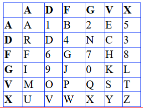
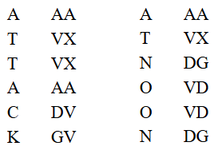
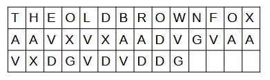
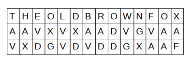
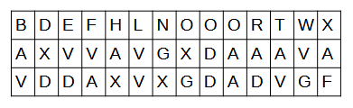

ADFGVX  is a cryptography cipher. You can read about it at <a href = https://en.wikipedia.org/wiki/ADFGVX_cipher>Wikipedia ADFGVX</a>
The implementation here seems to use p5.js library, but doesn't actually call it, so loading it isn't needed.

To use this one must
a) Put in an alphabet keyword.  If you don't know about Polybius keywords, see <a href = https://en.wikipedia.org/wiki/Polybius_square>Polybius Square.</a> We are using a 6x6 square.

b) Input a keyphrase. Probably ought to use all caps and only letters for this, however, it will likely work just as well with lower case, but will auto convert to uppercase. Digits can also be put into the keyphrase, but why would you?

c) Enter your message in the textarea.  Keep in mind that your message will be converted to ALL CAPs and digits, and no spaces.  When it is decoded by the receiver, they must be able to understand the message in the context of it being run together as a single list of letters.  The SHOW PLAINTEXT button will let you see what it will look like when decoded.
Also, there will likely be some non-sense letters coded onto the end of the message.  That is the way this ADFGVX encoding is intended to work.

d) Encode.  The button appears to do nothing, but it actually encodes your message using the 6x6 Polybius Square and your keyword alphabet. There is no output for the button.

e. Put Code Under $\alpha$-Keyphrase.  This finishes the ADFGVX code by rearranging the columns and showing the code to be sent in the textarea box to the right of the Message.  You can copy this and paste it into the Decode box to check.
Also, you can use the page to decode any received message provided that you have input the correct alphabet deyword and the correct keyphrase from your sender.  After putting those in, click RESET to assure that they have been read.  Then, having pasted your received message into the decode box, you can decode it with the button.

<h2>ADFGVX Overview</h2>
For the alphabet:

**Rule 1:**  Each digit, starting with 1 and ending with 0, will follow the first occurrence of the letters A through J.  So, A–>1, B–>2, etc.

The user key that I am making up is ABERDEEN.

Rule 2: Write the keyword into the square first, followed by all of the letters that do not appear in the keyword.  Also, if any letters appear multiple times in the keyword, just omit them except for their 1st occurrence.
Respect Rule 1. 

Now our alphabet looks like the image above.
The keyword can be any word or phrase of any length as long as it uses English. 
Doing a very simple Polybius square code from the alphabet might look like this, where the message is ATTACHATNOON.

**A Big Mess**

It is still too easy, but continuing from above, we will create a keyphrase that is in addition to the keyword.  The one I will make up is THEOLDBROWNFOX.  Understand that we will use both the keyword ABERDEEN to make our alphabet and now a new keyphrase.   The key phrase follows Rule 3.

**Rule 3:** After coding the message from the alphabet, write the keyphrase including all duplicate letters across the page and under each letter, put a letter of the code, always reading left to right. 

Here is what it looks like.

**Rule 3a:** For any blanks in the table, just add some randomly chosen letters from ADFGVX and the recipient can figure out the message by ignoring garbage at its end.

**Rule 4:** Alphabetize the keyphrase and move the columns around so that the letters which are currently under the keyphrase letter move with it. Keep repeat letters in the order that they currently exist.

After Rule 4, our table will look like this. That is, THEQUICKBROWNFOX alphabetizes to BDEFHLNOOORTWX and the code letters that were under those letters, stay under those letters.

Now that we have switched around the columns, it is a simple matter for the recipient, if she knows the keyphrase to correctly reorder them. So what we will send is the above code, reading left to right and putting a space after every five letters.  We send

AXVVA VGXDA  AAVAV DDAXV XGDAD VGF

 Clearly, it is no easy task to decode one of these transmissions without access to 
a) the keyword used to make the alphabet
b) the keyphrase over the columns
c) the rules.  I didn’t mention it, but you might see that changing the rules slightly would be an easy task, and obfuscate all.

Just like in modern code, long transmissions require frequent check digits since missing even one letter anywhere will make the entire code unintelligible. Those checks have not been built into this encoding.